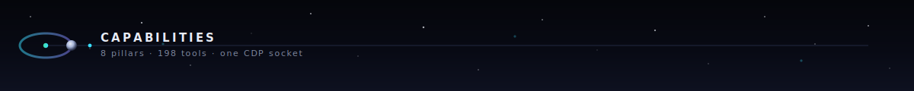

<div align="center">



<a href="https://github.com/german-krasnikov/luna-kiss-mcp">

</a>

</div>

<div align="center">

<sub>**STATUS**</sub><br>
<a href="./LICENSE"></a>


<sub>**SPEC**</sub><br>


<sub>**STACK**</sub><br>


</div>

> **MCP server bridging your AI coding assistant to Luna playable-ad builds running in Chrome** — over the Chrome DevTools Protocol. Token minimization is the soul of the project.

<sub>Works with</sub> <kbd>Claude Code</kbd> <kbd>OpenAI Codex CLI</kbd> <kbd>Cursor</kbd> <kbd>Windsurf</kbd> <kbd>any stdio MCP client</kbd>


## Why Luna MCP?

- **Stop burning tokens on boilerplate.** Each `batch` call replaces 5–20 individual MCP round-trips — **80–95% fewer tokens** on the same work.
- **Stop copy-pasting from Chrome DevTools.** Your assistant inspects the live Luna scene, edits runtime properties, captures screenshots, and triages console errors — all over CDP, without leaving the chat.
- **Stop guessing what broke.** 4-tier build diffing, physics backend detection, visual regression, and smart error triage — structured answers, not raw log dumps.

**Before / after — diagnosing a Luna playable build:**

```
Before: 5 separate MCP calls (~1500 tokens overhead)

get_hierarchy depth=2
get_component path="Canvas/EndCard" component_type="Image"
diagnose_object path="Canvas/EndCard"
screenshot
get_console level=E count=10
```

```
After: 1 batch call (~200 tokens, 87% savings)

batch("
  get_hierarchy depth=2
  get_component path=Canvas/EndCard component_type=Image
  diagnose_object path=Canvas/EndCard
  screenshot
  get_console level=E count=10
")
```


## Quick Start

**Prerequisites:** <kbd>Python 3.10+</kbd> · <kbd>Chrome</kbd> · <kbd>Claude Code / Codex CLI / any MCP client</kbd>

**1. Install the server**

```bash
git clone https://github.com/german-krasnikov/luna-kiss-mcp.git
cd luna-kiss-mcp/server && pip install -e ".[dev]"
```

**2. Launch Chrome with CDP**

```bash
# macOS
/Applications/Google\ Chrome.app/Contents/MacOS/Google\ Chrome \
  --remote-debugging-port=9222 --user-data-dir=/tmp/luna-debug-profile

# Linux
google-chrome --remote-debugging-port=9222 --user-data-dir=/tmp/luna-debug-profile
```

Open your Luna build URL in that Chrome window.

**3. Wire it up**

Add to `.mcp.json` (Claude Code) or `.codex/config.toml` (Codex CLI):

```json
{
  "mcpServers": {
    "luna-mcp": {
      "type": "stdio",
      "command": "python3",
      "args": ["-m", "luna_mcp.server"],
      "cwd": "/absolute/path/to/luna-kiss-mcp/server",
      "env": { "PYTHONPATH": "src" }
    }
  }
}
```

Restart your client. Ask: *"Inspect the Luna scene hierarchy"* — done.

<details>
<summary><b>Troubleshooting</b></summary>

- **"No Luna page found"** — Confirm Chrome launched with `--remote-debugging-port=9222`. Check `lsof -i :9222`.
- **Multiple tabs open** — Set `LUNA_PAGE_FILTER=my-build` to target the right tab.
- **Server doesn't appear** — Verify `cwd` points to `server/`, not the repo root. Restart your client.
- **Blank screenshots** — Luna page must be visible (not minimized). Try `--disable-gpu`.

</details>


## Features



- 💸 **Token Economy** — `batch` compresses 5–20 calls into one (80%+ savings), JPEG screenshots (3–5×), Set-of-Mark (70–90%), server-side Haiku sampling (~28k saved/shot)
- 🔎 **Scene Inspection** — hierarchy, components, objects by name/type, transpiled C# back-mapping
- ✍️ **Runtime Editing** — mutate properties live via CDP eval, post-flight reflection confirms changes
- 📸 **Visual Analysis** — screenshots, text summaries (30–100× lighter), baseline regression, SoM annotations
- 🧬 **Build Diffing** — 4-tier (file/semantic/visual/auto) with `log(N)` bisect to find the culprit
- 🪐 **Physics Forensics** — Goblin/Verlet/Baked/Unified backend detection, symptom classification, knowledge base
- 🚨 **Error Triage** — console streaming + smart domain routing (build/runtime/physics/Playworks)
- ⚡ **Performance** — frame-time breakdown, GPU/VRAM/startup probes, heap sampling, JS coverage
- 🚩 **Flag Discovery** — scan Jakefile for hidden flags, persistent catalog, intent-matched recommendations
- 🤖 **Macros & Batch** — intent→plan→validate→execute, domain-scoped macros (endcard/gameplay/monetization)
- 🛰️ **CDP Domains** — CPU throttle, device emulation, network conditions, gesture simulation, step frame


## Recent Changes

<div align="center">
  

<a href="https://german-krasnikov.github.io/luna-kiss-mcp/changelog/"></a>

<sub>See <a href="./CHANGELOG.md"><b>CHANGELOG.md</b></a> for full history</sub>

</div>


> [!IMPORTANT]
> **Unofficial community tool.** Luna MCP is an independent, community-built project. **Luna** is a product of **Luna Labs**. This project is **not affiliated with, endorsed by, or sponsored by Luna Labs.**

<div align="center">

<sub>MIT License · © <a href="https://github.com/german-krasnikov">German Krasnikov</a> · <a href="https://github.com/german-krasnikov/luna-kiss-mcp">⭐ Star</a></sub>


</div>
