<a id="readme-top"></a>

<div align="center">


<br/>

<a href="https://github.com/german-krasnikov/luna-kiss-mcp/blob/main/LICENSE"></a>
<a href="https://github.com/german-krasnikov/luna-kiss-mcp/releases"></a>


<br/>
<br/>

<strong>An MCP server that lets your AI coding assistant debug Luna playable-ad builds running in Chrome — over the Chrome DevTools Protocol.</strong>

<br/>

<sub>Works with</sub> <kbd>Claude Code</kbd> <kbd>OpenAI Codex CLI</kbd> <kbd>Cursor</kbd> <kbd>Windsurf</kbd> <kbd>any stdio MCP client</kbd>

</div>

# Luna MCP

<div align="center">


</div>

<div align="center">

<a href="./LICENSE"></a>


<br>


<br>
<a href="https://github.com/german-krasnikov/luna-kiss-mcp/issues"></a>


<br><br>


</div>


<div align="center">

### Contents

<a href="#token-economy">Token Economy</a> &nbsp;·&nbsp;
<a href="#philosophy--the-kiss-in-luna-kiss-mcp">Philosophy</a> &nbsp;·&nbsp;
<a href="#-capabilities">Capabilities</a> &nbsp;·&nbsp;
<a href="#first-steps">First Steps</a> &nbsp;·&nbsp;
<a href="#talk-to-your-build-watch-it-answer">Demo</a>
<br/>
<a href="#architecture">Architecture</a> &nbsp;·&nbsp;
<a href="#-tool-arsenal">Tool Arsenal</a> &nbsp;·&nbsp;
<a href="#setup">Setup &amp; Requirements</a> &nbsp;·&nbsp;
<a href="#environment-variables">Environment Variables</a> &nbsp;·&nbsp;
<a href="#troubleshooting">Troubleshooting</a>
<br/>
<a href="#the-crew">The Crew</a> &nbsp;·&nbsp;
<a href="#ecosystem--telemetry">Ecosystem</a> &nbsp;·&nbsp;
<a href="#flight-log--release-timeline">Flight Log</a> &nbsp;·&nbsp;
<a href="#-join-the-crew">Contribute</a>

</div>


## Token Economy

> **Luna MCP spends tokens like they are rent.**
> Every screenshot, every scene dump, every round-trip is squeezed before it ever reaches your model's context. Token minimization is not a feature here — it is the soul of the project.

<div align="center">
  
</div>

<br/>

| Mechanism | What it does | Savings |
|---|---|---|
| **`batch`** | Runs a multi-step workflow in a single round-trip | **80%+** fewer round-trips |
| **Visual Tier 1** | Returns a text summary instead of a raw PNG | **30–100×** smaller |
| **JPEG screenshots** | Ships JPEG instead of PNG | **3–5×** smaller |
| **Set-of-Mark** | Annotated screenshots for interactive flows | **70–90%** on interactive flows |
| **Cost Budget Router** | Smart routing of expensive calls | **up to 92%** |
| **Server-side sampling** | Haiku subprocess describes screenshots before they hit context | **~28k tokens** saved per screenshot |

Stacked on top: **plain-text responses** instead of JSON, and a **no-cache** design (Luna scene state mutates too fast to trust a cache — every read is live). Less ceremony, fewer tokens, same answers.


## Philosophy &mdash; the KISS in `luna-kiss-mcp`

> **Tokens are the budget. Everything else is an implementation detail.**
>
> An AI assistant debugging a live Chrome build can burn a context window in three
> screenshots. So Luna MCP treats every token like fuel on a lunar lander:
> measured, accounted for, never wasted. `KISS` &mdash; *Keep It Simple* &mdash; isn't
> a slogan in the repo name, it's the constraint we optimize against. The simplest
> thing that answers the question in the fewest tokens wins.

### The non-negotiables

| Principle | What it means here |
|---|---|
| **Token minimization is priority #1** | Plain-text over JSON, text summaries over PNGs, one batched round-trip over ten. Savings is the hero metric. |
| **SOLID / DRY / KISS** | Small, single-purpose modules. One way to do a thing. No clever where clear will do. |
| **TDD &mdash; Red &middot; Green &middot; Refactor** | **1,936 tests** across **147 files** guard every behavior before it ships. |
| **Files &lt; 200 lines, functions &lt; 50** | If a file outgrows the limit, it splits. Readability is a feature. |
| **Zero speculative abstraction** | No "for the future." We build what today's debugging session needs &mdash; nothing more. |

### The 6-layer composition stack

Every tool call descends through six guards &mdash; outermost first &mdash; so the
expensive mistakes never reach Chrome. This is the part you feel as *"it just
doesn't waste my context."*

| # | Layer | What it buys you |
|:-:|---|---|
| **1** | **Recorder** | Captures each request/response as redacted JSONL &mdash; replay any session deterministically. |
| **2** | **Hinter** | Spots anti-patterns and injects typemap lessons &mdash; steers the agent *before* it wastes a call. |
| **3** | **Degradation** | Graceful fallback when Chrome is down or the typemap is missing &mdash; a partial answer beats a hard crash. |
| **4** | **Budget gate** | Decides **run / downgrade / skip** by token cost &mdash; the spend dial of the whole server. |
| **5** | **Reflect** | Reads back only the values a mutation changed &mdash; saves 5&ndash;15k tokens per write, no re-fetch. |
| **6** | **Schema guard** | Pre-flight validation &mdash; catches typos and impossible mutations before they touch the build. |

> Six layers, one promise: the dumb, costly mistakes get filtered out on the way
> in &mdash; so your model spends its tokens on the bug, not on the boilerplate.

<div align="center">
  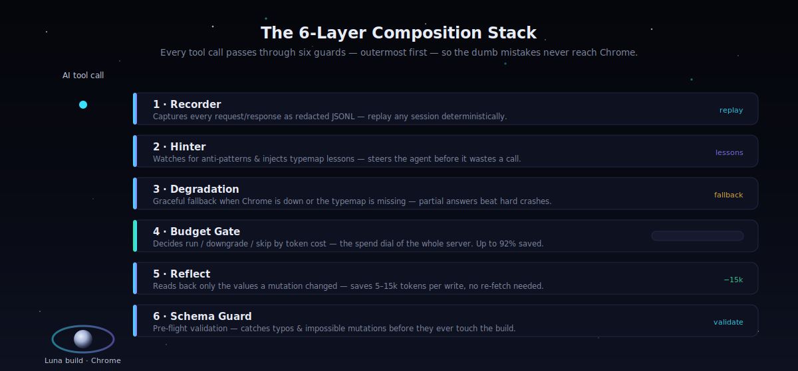
</div>


## 🛰️ Capabilities


**Eight instruments on one console — your AI assistant points a live Chrome tab at a Luna build and reads it like a flight recorder.**

<table>
<tr>
<td width="50%" valign="top">

### 🔎 Scene Inspection
Walk the live GameObject hierarchy, find objects by name or component, and read any component — Luna's transpiled C# scene, mapped straight back to source.

</td>
<td width="50%" valign="top">

### ✍️ Runtime Property Editing
Mutate properties and transforms on a running build through CDP eval, with post-flight reflection that reads the value back so you never guess whether it stuck.

</td>
</tr>
<tr>
<td width="50%" valign="top">

### 📸 Screenshots &amp; Visual Analysis
JPEG captures (3–5× lighter than PNG), Set-of-Mark annotated frames, Tier-1 text summaries, and baseline-driven visual regression — pixels in, tokens barely out.

</td>
<td width="50%" valign="top">

### 🧬 Build Diffing — 4-tier
Compare builds across **file**, **semantic**, **visual**, and **auto** tiers, then binary-search the culprit change in `log(N)` steps with `diff_builds`.

</td>
</tr>
<tr>
<td width="50%" valign="top">

### 🚩 Feature-Flag Exploration
Discover hidden build flags by scanning the Jakefile, browse a persistent catalog, and get intent-matched recommendations to shrink or reshape a build.

</td>
<td width="50%" valign="top">

### 🪐 Physics Diagnostics
Detect the active backend — **Goblin · Verlet · Baked · Unified** — classify symptoms, and query a seeded knowledge base with `diagnose_physics`.

</td>
</tr>
<tr>
<td width="50%" valign="top">

### 🚨 Console &amp; Error Triage
Stream `console` and network output, then route errors into build / runtime / physics / Playworks domains with smart triage instead of raw log dumps.

</td>
<td width="50%" valign="top">

### ⚡ Performance &amp; GPU Metrics
Frame-time breakdowns, draw calls, memory, plus native **GPU / VRAM / startup** probes — heap sampling, frame tracing, and JS coverage on demand.

</td>
</tr>
</table>

<div align="center">

<sub>🌙 Every readout above flows through the **Token Economy** layer — `batch` collapses multi-step workflows into one round-trip and responses come back as plain text, not JSON.</sub>

</div>


## First Steps

> **Three commands and one sentence** — from clone to *"Inspect the Luna scene hierarchy."*
> Watch it type itself below; then do exactly what the terminal does.

<div align="center">
  
</div>

### <samp>1</samp> &nbsp;Install

Clone the repo and install the server (editable, with dev extras):

```bash
git clone https://github.com/german-krasnikov/luna-kiss-mcp.git
cd luna-kiss-mcp/server
pip install -e ".[dev]"
```

> Requires **Python ≥ 3.10** (3.10 / 3.11 / 3.12 / 3.13).

### <samp>2</samp> &nbsp;Launch Chrome with CDP open

Start Chrome with remote debugging on a throwaway profile, then open your Luna build URL in that window:

```bash
google-chrome \
  --remote-debugging-port=9222 \
  --user-data-dir=/tmp/luna-debug-profile
```

> The `--user-data-dir` flag keeps debugging isolated from your everyday Chrome. Luna MCP **lazily auto-connects** to this port on your first tool call — no manual handshake. On macOS, swap `google-chrome` for `/Applications/Google\ Chrome.app/Contents/MacOS/Google\ Chrome`.

### <samp>3</samp> &nbsp;Wire it up & ask

Add `luna-mcp` to your MCP client config — `.mcp.json` for **Claude Code**, `.codex/config.toml` for **Codex CLI** (also works with Cursor, Windsurf, or any stdio MCP client). Then just ask:

```text
Inspect the Luna scene hierarchy
```

Your assistant calls `get_hierarchy` over CDP and answers in token-minimal plain text — no PNGs, no JSON bloat.

> 📎 **Full per-client config** (exact `.mcp.json` / `.codex/config.toml` snippets and env vars) lives in **[Setup](#setup)** just below.

<hr/>

<div align="center">
  <sub><b>Stuck at step 2?</b> Confirm CDP is live: <code>curl -s http://localhost:9222/json | python -m json.tool</code> should list your open tabs.</sub>
</div>


## Talk to your build. Watch it answer.

<div align="center">
  
</div>

You don't memorize tool names. You don't write CDP boilerplate. You speak to your AI assistant in plain language — Luna MCP picks the right instrument, fires it over the Chrome DevTools Protocol, and hands back telemetry instead of token-bloat.

<div align="center"><sub>One sentence in → the matching tool out. The point is the savings: <b>plain text, not PNG dumps.</b></sub></div>

<br/>

<table>
  <thead>
    <tr>
      <th align="left">🛰️ You ask</th>
      <th align="left">🌙 Luna MCP does <em>(tool)</em></th>
    </tr>
  </thead>
  <tbody>
    <tr>
      <td><em>"Why is this object invisible?"</em></td>
      <td>Walks the renderer, material, alpha, layer &amp; active state to find the real cause — <code>diagnose_object</code></td>
    </tr>
    <tr>
      <td><em>"Take a screenshot of the build."</em></td>
      <td>Captures the Luna iframe as a lean JPEG (3–5× smaller than PNG) — <code>screenshot</code></td>
    </tr>
    <tr>
      <td><em>"Inspect the scene hierarchy."</em></td>
      <td>Returns the GameObject tree as compact plain text, not JSON — <code>get_hierarchy</code></td>
    </tr>
    <tr>
      <td><em>"Diagnose the physics jitter."</em></td>
      <td>Detects the backend (Goblin / Verlet / Baked / Unified), classifies the symptom &amp; surfaces known fixes — <code>diagnose_physics</code></td>
    </tr>
    <tr>
      <td><em>"Compare these two builds."</em></td>
      <td>4-tier diff (file / semantic / visual / auto) with <code>log(N)</code> bisect to pin the culprit — <code>diff_builds</code></td>
    </tr>
    <tr>
      <td><em>"Show recent JS errors."</em></td>
      <td>Pulls buffered console output &amp; can triage it into build / runtime / physics / Playworks domains — <code>get_console</code></td>
    </tr>
    <tr>
      <td><em>"Run a multi-step endcard check in one shot."</em></td>
      <td>Plans → validates → executes a whole workflow in a single round-trip (80%+ token savings) — <code>batch</code> / <code>do</code></td>
    </tr>
  </tbody>
</table>

> [!TIP]
> Every row above is a real exposed tool. The magic isn't a chatbot wrapper — it's **149 tools** (112 AI-exposed + 37 batch-only) routed through a [6-layer composition stack](#the-6-layer-composition-stack) so the assistant gets answers, not raw dumps. Ask in your own words; Luna MCP maps intent → instrument.


<div align="center">

## Architecture

**One server, three worlds, zero glue.** Your AI assistant speaks plain MCP over `stdio`; Luna MCP translates intent into Chrome DevTools Protocol calls over a WebSocket; Chrome runs the Luna playable build with JS helpers injected straight into its iframe. Telemetry flows back the same way — text-first, token-minimal.

</div>

<div align="center">
  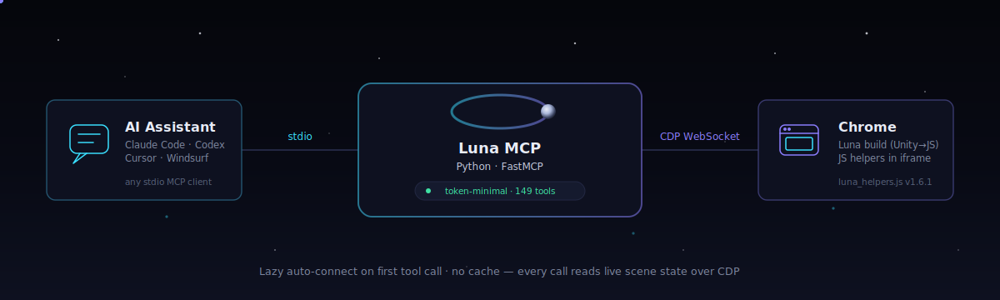
</div>

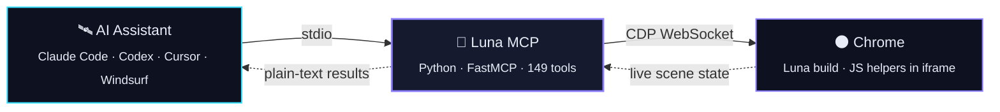

> **Lazy auto-connect.** Nothing dials out at boot. The first tool call triggers `_ensure_connected()`, which finds the Luna page, opens the CDP WebSocket, and injects the JS helpers into the iframe — re-injecting automatically if the socket drops and reconnects.
>
> **No cache, by design.** A Luna scene mutates faster than any cache could stay honest, so every call reads live state over CDP. You never debug a stale snapshot — what you query is what's on screen right now.

<div align="center">

### The 6-layer composition stack &mdash; in flight

Every tool call descends through six wrappers, outermost first. Each layer earns its place — recording, hinting, surviving an outage, spending tokens wisely, verifying mutations, and catching typos before they hit the wire.

</div>

<div align="center">
  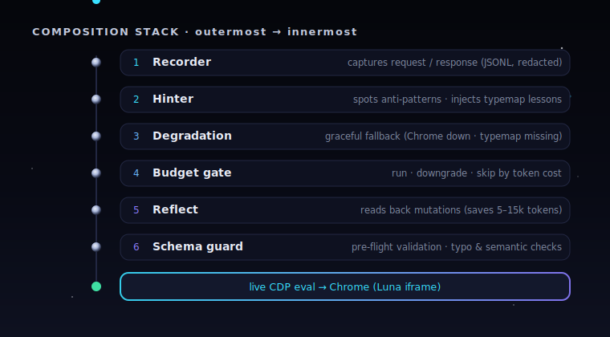
</div>

| # | Layer | What it does |
|:-:|:--|:--|
| 1 | **Recorder** | Captures request / response as redacted JSONL (gated by `LUNA_RECORD`) |
| 2 | **Hinter** | Observes behavioral anti-patterns · injects typemap lessons |
| 3 | **Degradation** | Graceful fallback — L1 Chrome down, L2 typemap missing |
| 4 | **Budget gate** | Decides **run / downgrade / skip** based on token cost |
| 5 | **Reflect** | Reads back modified values post-flight (saves 5–15k tokens per mutation) |
| 6 | **Schema guard** | Pre-flight validation — typo detection + semantic checks |


## 🛰️ Tool Arsenal

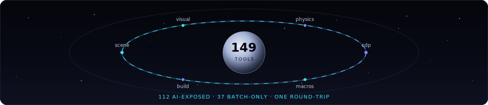

> **149 tools** ride the same orbit: **112 AI-exposed** for your assistant to call directly, plus **37 batch-only** building blocks that the `batch` engine sequences into a single round-trip. Everything speaks **plain text, not JSON**, so every response stays token-light.

### ⭐ Headline instruments

The ten tools you'll reach for first — the control room's primary readouts.

| Tool | What it does |
| :--- | :--- |
| `get_hierarchy` | Walk the live Luna scene tree — GameObjects, components, depth — distilled for tokens. |
| `screenshot` | Capture the running build as a **JPEG** (3–5× lighter than PNG) for fast visual context. |
| `diagnose_object` | One-shot health report on a single object: transform, components, render state, gotchas. |
| `diagnose_physics` | Detect the active physics backend (**Goblin / Verlet / Baked / Unified**) and triage symptoms. |
| `get_console` | Pull buffered Chrome console output — logs, warnings, runtime errors. |
| `get_performance_metrics` | Frame time, draw calls, memory, plus GPU / VRAM / startup probes. |
| `set_property` | Mutate any runtime property live; the result is reflected back so you skip a re-read. |
| `batch` | **The signature move** — run a multi-step workflow in **one round-trip** for **80%+ token savings**. |
| `do` | Natural-intent macro: describe the goal, get a planned-validated-executed tool sequence. |
| `diff_builds` | Compare two builds across **4 tiers** (file / semantic / visual / auto) to find what changed. |

> 💡 **`batch` is the soul of the project.** Instead of one chatty request per step, you hand it a plan and it returns once — collapsing round-trips, tokens, and latency all at once.

---

### 🧭 The full catalog

Grouped by category. Open a panel to see the instruments inside.

<details>
<summary><b>🌐 Scene Inspection</b> — read and search the live scene graph</summary>

<br/>

| Tool | Purpose |
| :--- | :--- |
| `get_hierarchy` | Token-distilled scene tree of GameObjects and components. |
| `get_component` | Inspect a single component's serialized fields. |
| `get_object_detail` | Deep dump for one object (transform + components + state). |
| `find_objects` | Locate objects by name across the scene. |
| `find_objects_by_component` | Find every object carrying a given component type. |
| `distill_hierarchy` | Summarize deep trees and filter by a relevance threshold. |
| `eval_js` | Execute raw JS inside the Luna iframe for ad-hoc probing. |

</details>

<details>
<summary><b>🎬 Visual & Screenshots</b> — pixels, summaries, and regression</summary>

<br/>

| Tool | Purpose |
| :--- | :--- |
| `screenshot` | JPEG capture of the running build (downscaled, token-aware). |
| `screenshot_som` | **Set-of-Mark** annotated capture — 70–90% savings on interactive flows. |
| `visual_summary` | **Tier 1** text description instead of a PNG — 30–100× token savings. |
| `analyze_visual` | Cost Budget Router picks the cheapest path to an answer (up to 92% savings). |
| `analyze_screenshot` / `describe_playable` | Server-side LLM read of the frame (~28k tokens saved per shot). |
| `verify_visual_state` | Assert the screen matches an expected state. |
| `click_marker` / `inspect_marker` | Drive and read Set-of-Mark elements by index. |
| `motion_summary` / `analyze_animation` | Tier 1 motion text and multi-frame animation analysis. |
| `visual_baseline_save` / `_check` / `_list` / `_invalidate` | Visual Regression v2 baseline workflow. |

</details>

<details>
<summary><b>🪐 Physics</b> — Goblin / Verlet / Baked / Unified forensics</summary>

<br/>

| Tool | Purpose |
| :--- | :--- |
| `diagnose_physics` | Identify the backend and classify the symptom you're seeing. |
| `physics_health_check` | Fast pass/fail sweep over the physics state. |
| `physics_query` | Query simulation specifics (bodies, contacts, parameters). |
| `inspect_bodies` | Forensic dump of active rigid/soft bodies. |

</details>

<details>
<summary><b>🏗️ Build & Assets</b> — diff, optimize, and shrink the bundle</summary>

<br/>

| Tool | Purpose |
| :--- | :--- |
| `analyze_build` | Pure-Python build analysis — no Chrome required. |
| `index_build` / `list_builds` / `diff_builds` | Snapshot, list, and 4-tier compare builds. |
| `optimize_build_size` / `optimize_status` | Orchestrate Jakefile + PC-module + asset savings toward a target. |
| `audit_assets` / `analyze_texture` / `recommend_asset_optimization` | Walk assets, profile textures (Pillow), recommend compression. |
| `audit_pc_modules` / `recommend_pc_replacements` | Audit PlayCanvas module usage and propose lighter swaps. |
| `luna_config_get` / `luna_config_diff` | Read and diff the Luna build config. |
| `discover_jake_tasks` | Enumerate available Jake build tasks. |
| `lint_csharp` / `audit_required_apis` | Static C# analysis before the build ever runs. |

</details>

<details>
<summary><b>🚩 Flags</b> — discover and recommend hidden build flags</summary>

<br/>

| Tool | Purpose |
| :--- | :--- |
| `discover_flags` | Scan the Jakefile for hidden / undocumented feature flags. |
| `list_flag_catalog` | Browse the persistent catalog of known flags. |
| `recommend_flags` | Suggest flags that match a stated optimization intent. |

</details>

<details>
<summary><b>📊 Performance & Probes</b> — frame time, GPU, memory, traces</summary>

<br/>

| Tool | Purpose |
| :--- | :--- |
| `get_performance_metrics` | Frame time, draw calls, memory + GPU / VRAM / startup probes. |
| `cdp_perf_metrics` | Raw CDP frame-time breakdown. |
| `trace_frames` | Async frame-trace collection with timeline summary. |
| `heap_sample` | Sampling-profiler heap snapshot with Tier 1 analysis. |
| `coverage_report` | JS coverage map reconciled back to C# source. |
| `audit_particles` | Particle-system cost and health audit. |

</details>

<details>
<summary><b>🔬 Diagnostics</b> — animators, text, tappability, lifecycle, console triage</summary>

<br/>

| Tool | Purpose |
| :--- | :--- |
| `diagnose_object` / `diagnose_rendering` / `diagnose_text` | Targeted health reports per subsystem. |
| `get_animator_graph` | Dump the animator state graph and transitions. |
| `why_not_tappable` / `hit_test` | Explain why an element isn't receiving input. |
| `tween_inventory` / `tween_health` | Inspect DOTween state and flag stuck tweens. |
| `wait_for_lifecycle` / `lifecycle_events` | Await and stream Luna lifecycle events. |
| `insights_state` / `insights_events` | Read the Playworks INSIGHTS subsystem. |
| `get_console` / `triage_console` | Buffer console output, then classify errors by domain. |
| `watchdog_report` | Async anomaly detector cross-correlating errors + metrics. |
| `get_luna_counters` / `inspect_environment` / `get_shader_variants` | Low-level engine counters and environment state. |
| `explain_code` / `explain_function` | Typemap-aware explanation of transpiled C# logic. |

</details>

<details>
<summary><b>🤖 Macros & Batch</b> — intent in, validated plan out</summary>

<br/>

| Tool | Purpose |
| :--- | :--- |
| `batch` | **One round-trip** for a multi-step workflow — **80%+ token savings.** |
| `do` / `ask` | General intent → plan → validate → execute. |
| `endcard` / `gameplay` / `monetization` | Domain-scoped macros for common playable-ad flows. |
| `route_intent` | Predictively dispatch a request to the optimal tool. |
| `generate_playtest` / `run_generated_playtest` | Generate and run minimal UX test scripts from intent. |
| `template` / `template_list` / `template_save` | Pre-compiled batch shortcuts. |
| `record_start` / `record_stop` / `record_list` / `replay` / `record_diff` | Record and replay MCP sessions. |
| `check_compliance` | Audit the build against size / format / runtime rules. |

</details>

<details>
<summary><b>🛰️ CDP Domains</b> — native Chrome DevTools control</summary>

<br/>

| Tool | Purpose |
| :--- | :--- |
| `set_cpu_throttle` / `set_device_metrics` / `clear_emulation` | Throttle the CPU and emulate devices. |
| `set_network` / `block_urls` / `clear_network` | Apply network conditions and URL blocks. |
| `simulate_swipe` | Synthetic touch gestures via the CDP Input domain. |
| `pause_game` / `resume_game` / `step_frame` | Freeze, resume, and single-step the runtime. |
| `set_transform` | Set an object's transform directly. |
| `set_budget` / `get_budget_status` / `mcp_stats` | Tune the token budget and read server telemetry. |
| `get_connection_info` / `luna_debug_discover` | Inspect the CDP connection and discover endpoints. |

</details>

> *Some tools are **batch-only** (no direct AI surface) — they exist as composable steps the `batch` engine wires together. The categories above show representative instruments, not an exhaustive listing of all 149.*


## Setup

> **Unofficial community tool.** Luna MCP is an independent, community-built project. **Luna** is a product of [**Luna Labs**](https://lunalabs.io). This project is **not affiliated with, endorsed by, or sponsored by Luna Labs.**

Everything you need to connect Luna MCP to your AI assistant — requirements, installation, launching Chrome on every OS, and per-client configuration.

### Requirements

- Python `>= 3.10` (3.10 / 3.11 / 3.12 / 3.13)
- Google Chrome (or Chromium) launched with `--remote-debugging-port=9222`
- A Luna build served locally or remotely and opened in that Chrome instance
- **Luna Debugger** Chrome extension (optional but recommended — see below)

<details>
<summary><b>🔭 Luna Debugger Extension</b> — optional, unlocks the full ~112-tool surface</summary>

<br/>

The [Luna Debugger](https://lunalabs.io) is a Chrome extension that ships with the Luna SDK. It exposes `pc.Debugger.*` APIs inside the browser, giving Luna MCP access to deep runtime introspection.

**Without the extension** (~60 tools work): scene hierarchy, screenshots, console, performance metrics, property editing, transforms, animations, build analysis, physics probes, diagnostics, lifecycle, interactions — everything that runs via standard CDP and injected JS helpers.

**With the extension** (~112 tools work): adds component field introspection, type info, enum values, custom component registration, animator state details, collider visualization, raw debugger message API, coverage mapping, and advanced probe tools.

To install: open a Luna build in Chrome, then follow the [Luna Debugger setup guide](https://docs.lunalabs.io/docs/playable/code/plugin-in-browser/debug-js/). The extension activates automatically when a Luna build is detected.

> **Tip:** If you don't have the extension, Luna MCP still works — tools that require it return a clear error message and the rest function normally.

</details>

### Installation

```bash
git clone https://github.com/german-krasnikov/luna-kiss-mcp.git
cd luna-kiss-mcp/server
pip install -e ".[dev]"
```

### Launch Chrome

Chrome must be running with remote debugging enabled **before** the MCP server connects. Open your Luna build URL in that Chrome window once it's up.

<details>
<summary><b>🍎 macOS</b></summary>

<br/>

```bash
/Applications/Google\ Chrome.app/Contents/MacOS/Google\ Chrome \
  --remote-debugging-port=9222 \
  --user-data-dir=/tmp/luna-debug-profile
```

</details>

<details>
<summary><b>🐧 Linux</b></summary>

<br/>

```bash
google-chrome --remote-debugging-port=9222 --user-data-dir=/tmp/luna-debug-profile
```

</details>

<details>
<summary><b>🪟 Windows (PowerShell)</b></summary>

<br/>

```powershell
& "C:\Program Files\Google\Chrome\Application\chrome.exe" `
  --remote-debugging-port=9222 `
  --user-data-dir="$env:TEMP\luna-debug-profile"
```

</details>

> **Important:** The `--user-data-dir` flag is required when Chrome is already running — without it, the debugging port flag is silently ignored.

### Setup: Claude Code

Claude Code supports MCP servers via JSON config. Two scopes:

| Scope | File | Use case |
|-------|------|----------|
| **Project** | `.mcp.json` in project root | Shared with team, checked into git |
| **User** | `~/.claude.json` | Personal, all projects |

<details>
<summary><b>Option A — Project config (recommended)</b></summary>

<br/>

Create `.mcp.json` in your project root:

```json
{
  "mcpServers": {
    "luna-mcp": {
      "type": "stdio",
      "command": "python3",
      "args": ["-m", "luna_mcp.server"],
      "cwd": "/absolute/path/to/luna-kiss-mcp/server",
      "env": {
        "PYTHONPATH": "src"
      }
    }
  }
}
```

</details>

<details>
<summary><b>Option B — Using a virtualenv</b></summary>

<br/>

If you installed into a virtualenv, point `command` directly at it:

```json
{
  "mcpServers": {
    "luna-mcp": {
      "type": "stdio",
      "command": "/absolute/path/to/luna-kiss-mcp/server/.venv/bin/python3",
      "args": ["-m", "luna_mcp.server"],
      "cwd": "/absolute/path/to/luna-kiss-mcp/server",
      "env": {
        "PYTHONPATH": "src"
      }
    }
  }
}
```

</details>

<details>
<summary><b>Option C — With environment variables</b></summary>

<br/>

```json
{
  "mcpServers": {
    "luna-mcp": {
      "type": "stdio",
      "command": "python3",
      "args": ["-m", "luna_mcp.server"],
      "cwd": "/absolute/path/to/luna-kiss-mcp/server",
      "env": {
        "PYTHONPATH": "src",
        "LUNA_CDP_PORT": "9222",
        "LUNA_PAGE_FILTER": "my-build",
        "LUNA_PLUGIN_PATH": "/path/to/Playworks/7.1.0",
        "LUNA_BUDGET_MODE": "deep_debug"
      }
    }
  }
}
```

</details>

**Verify** — restart Claude Code (or run `/mcp` to check status), then ask:

```text
Inspect the Luna scene hierarchy
```

or

```text
Take a screenshot of the current build
```

### Setup: OpenAI Codex CLI

Codex CLI uses TOML config. Two scopes:

| Scope | File | Use case |
|-------|------|----------|
| **Project** | `.codex/config.toml` in project root | Shared with team |
| **User** | `~/.codex/config.toml` | Personal, all projects |

<details>
<summary><b>Option A — Project config (recommended)</b></summary>

<br/>

Create `.codex/config.toml` in your project root:

```toml
[mcp_servers.luna-mcp]
command = "python3"
args = ["-m", "luna_mcp.server"]
cwd = "/absolute/path/to/luna-kiss-mcp/server"

[mcp_servers.luna-mcp.env]
PYTHONPATH = "src"
```

</details>

<details>
<summary><b>Option B — Using a virtualenv</b></summary>

<br/>

```toml
[mcp_servers.luna-mcp]
command = "/absolute/path/to/luna-kiss-mcp/server/.venv/bin/python3"
args = ["-m", "luna_mcp.server"]
cwd = "/absolute/path/to/luna-kiss-mcp/server"

[mcp_servers.luna-mcp.env]
PYTHONPATH = "src"
```

</details>

<details>
<summary><b>Option C — With environment variables</b></summary>

<br/>

```toml
[mcp_servers.luna-mcp]
command = "python3"
args = ["-m", "luna_mcp.server"]
cwd = "/absolute/path/to/luna-kiss-mcp/server"

[mcp_servers.luna-mcp.env]
PYTHONPATH = "src"
LUNA_CDP_PORT = "9222"
LUNA_PAGE_FILTER = "my-build"
LUNA_BUDGET_MODE = "deep_debug"
```

</details>

**Verify** — restart Codex CLI, then ask:

```text
Use luna-mcp to get the scene hierarchy
```

### Setup: Other MCP Clients

Any MCP client that supports stdio transport can connect. The server command is always:

```bash
cd /path/to/luna-kiss-mcp/server && PYTHONPATH=src python3 -m luna_mcp.server
```

The server communicates via stdin/stdout using the MCP protocol. No HTTP server, no ports — just stdio.

**Cursor / Windsurf / Continue:** These editors use the same JSON format as Claude Code. Add the `luna-mcp` entry to their respective MCP config files.

### Environment Variables

| Var | Default | Description |
|-----|---------|-------------|
| `LUNA_CDP_PORT` | `9222` | Chrome remote debugging port |
| `LUNA_PAGE_FILTER` | — | Substring to filter Luna page URL (useful when multiple tabs are open) |
| `LUNA_PLUGIN_PATH` | — | Path to Playworks plugin for typemap resolution (enables C#→JS mapping) |
| `LUNA_VISUAL_LLM` | `0` | Enable server-side LLM analysis on screenshots (`1` to enable) |
| `LUNA_BUDGET_MODE` | `work` | Token budget: `warmup` (5k) / `work` (30k) / `deep_debug` (100k) / `auto` |
| `LUNA_BUDGET_DISABLED` | `0` | Disable cost budget router entirely (`1` to disable) |
| `LUNA_RECORD` | `0` | Record MCP sessions to JSONL (`1` to enable) |
| `LUNA_MCP_DATA_DIR` | `~/.luna_mcp` | Data directory for lessons DB, baselines, templates |
| `LUNA_CHROME_BIN` | `google-chrome` | Chrome binary path for CI harness |
| `LUNA_SCREENSHOT_FORMAT` | `jpeg` | Screenshot format: `jpeg` or `png` (jpeg saves 3-5x tokens) |
| `LUNA_SCREENSHOT_QUALITY` | `75` | JPEG quality (1-100) for token efficiency |

### Troubleshooting

<details>
<summary><b>"No Luna page found" / connection refused</b></summary>

<br/>

- Confirm Chrome launched with `--remote-debugging-port=9222` (check `lsof -i :9222` on macOS/Linux).
- The `--user-data-dir` flag is required on macOS when Chrome is already running — without it, the flag is silently ignored.
- If multiple tabs are open, set `LUNA_PAGE_FILTER` to a substring of your build's URL so the server targets the right tab.

</details>

<details>
<summary><b>MCP server doesn't appear in your client</b></summary>

<br/>

- Restart the client after editing the MCP config.
- Verify `cwd` points to the `server/` subdirectory of this repo, not the repo root.
- Run manually to surface errors: `cd server && PYTHONPATH=src python3 -m luna_mcp.server`
- Check that Python >= 3.10 is being used: `python3 --version`

</details>

<details>
<summary><b>"Module not found" errors</b></summary>

<br/>

- Ensure you ran `pip install -e ".[dev]"` from the `server/` directory.
- If using a virtualenv, make sure `command` in the config points to the venv Python, not the system one.

</details>

<details>
<summary><b>Screenshots are blank / all black</b></summary>

<br/>

- The Luna page must be visible (not minimized or in a background tab) when the screenshot tool fires.
- Try adding `--disable-gpu` to Chrome launch flags.

</details>

<details>
<summary><b>Server connects but tools return errors</b></summary>

<br/>

- Check `get_console level=E count=20` for JS errors in the Luna build itself.
- Ensure the Luna build has finished loading before calling tools.
- Try `ping` first — it verifies the CDP connection without touching the scene.

</details>

### Development & CI

```bash
cd server && pytest tests/ -v            # 1936 tests across 147 test files
cd server && python3 -m luna_mcp.server  # run server manually
```

Luna MCP includes a headless CI runner for build validation — it generates a JUnit XML report with timing and baseline comparison results:

```bash
python3 -m luna_mcp.cli.ci \
  --baselines baseline1,baseline2 \
  --build-path /path/to/build/index.html \
  --chrome-bin /path/to/chrome
```


## The Crew

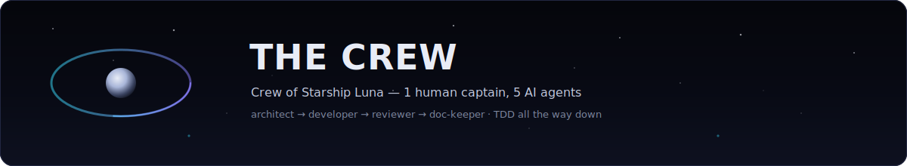

<div align="center">

<em>Luna MCP is flown by one human captain and a crew of five AI agents — each a documented, model-backed station in the build pipeline. Real names. Real models. Real roles.</em>

<br/><br/>

<table>
<tr>
<td align="center" width="640">


<br/><br/>

### 🛰️ German Krasnikov · **Captain**

<a href="https://github.com/german-krasnikov"></a>


<sub>Charts the mission, commissions the agents, signs off the launch.</sub>

</td>
</tr>
</table>

<br/>

<h3>⟡ The Agent Roster — organized by station</h3>

<sub>Five autonomous crewmates, grouped by category. Each one is a real, documented agent in the repo.</sub>

<br/><br/>

<table>
<tr>
<td align="center" width="240" valign="top">

<br/>
<sub>🪐 <b>ARCHITECTURE</b></sub>
<br/>
<b>senior-architect</b>
<br/>

<br/>
<sub>Designs module structure, CDP comms &amp; serialization formats.</sub>
</td>
<td align="center" width="240" valign="top">

<br/>
<sub>⚙️ <b>ENGINEERING</b></sub>
<br/>
<b>senior-developer</b>
<br/>

<br/>
<sub>Writes code &amp; tests via TDD — Red&nbsp;→&nbsp;Green&nbsp;→&nbsp;Refactor.</sub>
</td>
<td align="center" width="240" valign="top">

<br/>
<sub>🛡️ <b>QUALITY &amp; SECURITY</b></sub>
<br/>
<b>code-reviewer</b>
<br/>

<br/>
<sub>Audits quality, security, performance &amp; token efficiency.</sub>
</td>
</tr>
<tr>
<td align="center" width="240" valign="top">

<br/>
<sub>📡 <b>DOCUMENTATION</b></sub>
<br/>
<b>doc-keeper</b>
<br/>

<br/>
<sub>Syncs docs, sweeps temp files, signs the final commit.</sub>
</td>
<td align="center" width="240" valign="top">

<br/>
<sub>🔭 <b>FIELD DEBUGGING</b></sub>
<br/>
<b>luna-debugger</b>
<br/>

<br/>
<sub>Debugs Luna builds live in Chrome, over CDP.</sub>
</td>
<td align="center" width="240" valign="top">
<br/>
<sub>⟡</sub>
<br/>
<sub><i>Every station<br/>reports to the Captain.</i></sub>
</td>
</tr>
</table>

<br/>

<h4>The mission flight plan</h4>

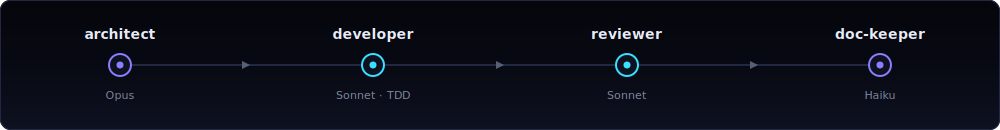

<br/>

<sub><code>architect</code> → <code>developer (TDD)</code> → <code>reviewer</code> → <code>fixes</code> → <code>doc-keeper</code> &nbsp;·&nbsp; <code>luna-debugger</code> rides along for live field calls.</sub>

</div>


<h2 align="center">Ecosystem &amp; Telemetry</h2>

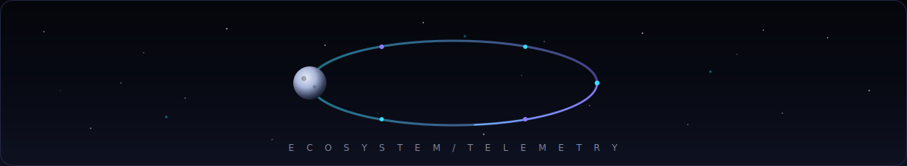

<p align="center">
  <em>One small server, one wide orbit. Luna MCP rides on a stack you already trust — and docks with any stdio MCP client.</em>
</p>

<br />

<h3 align="center">⬡ Powered by</h3>

<p align="center">
  <a href="https://www.python.org/"></a>
  <a href="https://github.com/jlowin/fastmcp"></a>
  <a href="https://chromedevtools.github.io/devtools-protocol/"></a>
</p>

<p align="center">
  <a href="https://python-pillow.github.io/"></a>
  <a href="https://websockets.readthedocs.io/"></a>
  <a href="https://docs.aiohttp.org/"></a>
  <a href="https://www.anthropic.com/claude"></a>
</p>

<p align="center">
  <sub><b>Tech allies, not dependencies-for-show.</b> Python orchestrates · FastMCP/MCP speaks <code>stdio</code> · CDP over a WebSocket drives Chrome · Pillow reads pixels · <code>websockets</code> + <code>aiohttp</code> wire the transport · Claude (Haiku) does server-side sampling to keep your token bill tiny.</sub>
</p>

<br />

<h3 align="center">◑ Compatibility Matrix</h3>

<p align="center">
  <sub>Luna MCP is a plain <b>stdio MCP server</b>. If your assistant can launch a subprocess and speak MCP, it can fly Luna.</sub>
</p>

<div align="center">

| MCP Client | Supported | Notes |
| :--- | :---: | :--- |
| **Claude Code** | ✅ | First-class. Configure via `.mcp.json`; built &amp; dogfooded here. |
| **OpenAI Codex CLI** | ✅ | Configure via `.codex/config.toml`. |
| **Cursor** | ✅ | Add as an MCP server in settings — same `stdio` launch command. |
| **Windsurf** | ✅ | Register the `stdio` server; tools appear inline. |
| **Any stdio MCP client** | ✅ | Protocol-native. No client lock-in — `stdio` in, plain-text out. |

</div>

<p align="center">
  <sub>🛰️ <b>112</b> AI-exposed tools · <b>37</b> batch-only · <b>149</b> total — over one calm orbit.</sub>
</p>

<br />

<h3 align="center">✦ Live Telemetry</h3>

<p align="center">
  <a href="https://github.com/german-krasnikov/luna-kiss-mcp/stargazers"></a>
  <a href="https://github.com/german-krasnikov/luna-kiss-mcp/network/members"></a>
  <a href="https://github.com/german-krasnikov/luna-kiss-mcp/issues"></a>
  <a href="https://github.com/german-krasnikov/luna-kiss-mcp/commits"></a>
</p>

<p align="center">
  <a href="https://github.com/german-krasnikov/luna-kiss-mcp/blob/main/LICENSE"></a>
  
  <a href="https://github.com/german-krasnikov/luna-kiss-mcp"></a>
</p>


<div align="center">

## Flight Log — Release Timeline

</div>

<div align="center">
  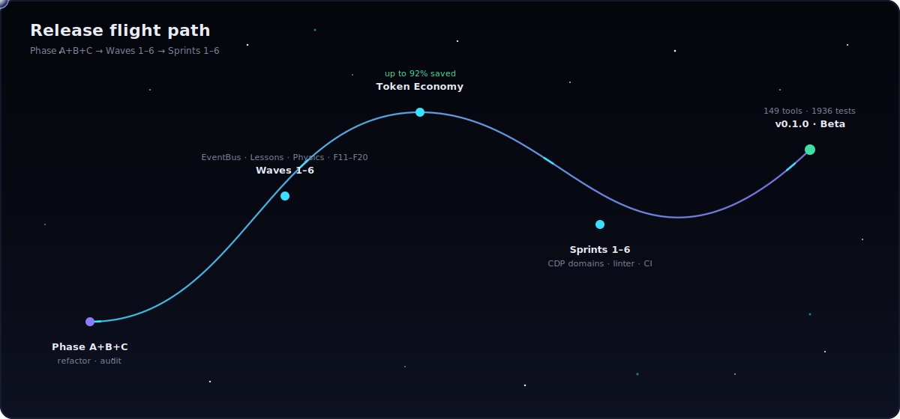
</div>

<table>
<thead>
<tr>
<th align="left">Milestone</th>
<th align="left">Tag</th>
<th align="left">What landed</th>
</tr>
</thead>
<tbody>

<tr>
<td>🛰️ <b>Phase A+B+C</b></td>
<td></td>
<td><b>Foundation.</b> Refactor + audit. The CDP bridge (auto-reconnect), JS helper injection into the Luna iframe, JS→C# source mapping, and the Playworks typemap resolver. Guardrails set: SOLID / DRY / KISS / TDD, files &lt; 200 lines.</td>
</tr>

<tr>
<td>🧠 <b>Waves 1–6</b></td>
<td></td>
<td><b>The brain.</b> EventBus + Action Templates + Visual Regression v2 · MetricsRegistry + LessonStore + Speculator + Watchdog + Macro-tools · Typemap-aware lessons + Multi-Frame Visual + Graceful Degradation · Budget Auto-tuning + Playable Replay · <b>Physics Detective</b> (Goblin / Verlet / Baked / Unified) · SamplingService brain features <code>F11–F20</code>.</td>
</tr>

<tr>
<td>💎 <b>Token Economy</b></td>
<td></td>
<td><b>The soul of the project.</b> <code>batch</code> = one round-trip (80%+) · Visual Tier 1 text-not-PNG (30–100×) · JPEG screenshots (3–5×) · Set-of-Mark annotations (70–90%) · Cost Budget Router (up to 92%) · plain-text responses · Haiku server-side sampling (~28k tokens/screenshot).</td>
</tr>

<tr>
<td>🚀 <b>Sprints 1–6</b></td>
<td></td>
<td><b>Probes &amp; field-readiness.</b> Token economics + native perf probes · animator/INSIGHTS/tween diagnostics · synthetic gestures + lifecycle + physics forensics · native CDP domains (emulation / network / heap / trace / coverage) · C# linter + Jake discovery · headless CI harness (JUnit XML) + GPU / VRAM / startup probes.</td>
</tr>

<tr>
<td>🌕 <b>v0.1.0 — Beta</b></td>
<td> </td>
<td><b>Touchdown.</b> <b>149 tools</b> (112 AI-exposed + 37 batch-only) · <b>1936 tests</b> across 147 files · ~23,779 LOC · Python 3.10–3.13 · <code>luna_helpers.js</code> v1.6.1.</td>
</tr>

</tbody>
</table>

<div align="center">
<sub>Full reverse-chronological detail lives in <a href="./CHANGELOG.md"><b>CHANGELOG.md</b></a> · <a href="https://keepachangelog.com/en/1.1.0/">Keep a Changelog</a> format.</sub>
</div>


<div align="center">

## 🛰️ Join the crew

**Pull requests are welcome.** Found a bug, a flaky probe, or a tool that burns too many tokens? Open an issue — or send a PR.

[](https://github.com/german-krasnikov/luna-kiss-mcp/issues)
[](https://github.com/german-krasnikov/luna-kiss-mcp/pulls)

New contributors: the project runs on **SOLID / DRY / KISS / TDD** (Red-Green-Refactor) — files under 200 lines, functions under 50, and `pytest tests/ -v` green before every commit. The bar is high, the diffs are small.

</div>

<br/>

<div align="center">

### ⭐ If Luna MCP saved you a few thousand tokens, star it

A star helps other playable-ad engineers find a quieter way to debug.

<a href="https://github.com/german-krasnikov/luna-kiss-mcp/stargazers">
  
</a>

</div>

<details align="center">
<summary><b>📈 Star history</b></summary>
<br/>
<a href="https://star-history.com/#german-krasnikov/luna-kiss-mcp&Date">
  
</a>
</details>

<br/>

> [!IMPORTANT]
> **Unofficial community tool.** Luna MCP is an independent, community-built project. **Luna** is a product of **Luna Labs**. This project is **not affiliated with, endorsed by, or sponsored by Luna Labs.** All product names, trademarks, and registered trademarks are the property of their respective owners.

<div align="center">

**Built by** [ German Krasnikov](https://github.com/german-krasnikov) — Maintainer &amp; Creator — with an AI crew of **senior-architect**, **senior-developer**, **code-reviewer**, **doc-keeper**, and **luna-debugger**.

📄 Licensed under the **[MIT License](LICENSE)** &nbsp;·&nbsp; Status: **Beta (v0.1.0)** &nbsp;·&nbsp; Python ≥ 3.10

`luna` &nbsp; `mcp` &nbsp; `cdp` &nbsp; `chrome` &nbsp; `devtools` &nbsp; `unity` &nbsp; `debugging` &nbsp; `playable` &nbsp; `ai` &nbsp; `claude`

<sub><a href="#readme-top">▲ Back to top</a> &nbsp;·&nbsp; <a href="#first-steps">Quick start</a> &nbsp;·&nbsp; <a href="#token-economy">Token economy</a> &nbsp;·&nbsp; <a href="https://github.com/german-krasnikov/luna-kiss-mcp">Repository</a></sub>

</div>

<br/>

<div align="center">
  
</div>

<div align="center"><sub>Quiet tools for loud builds. 🌑</sub></div>
